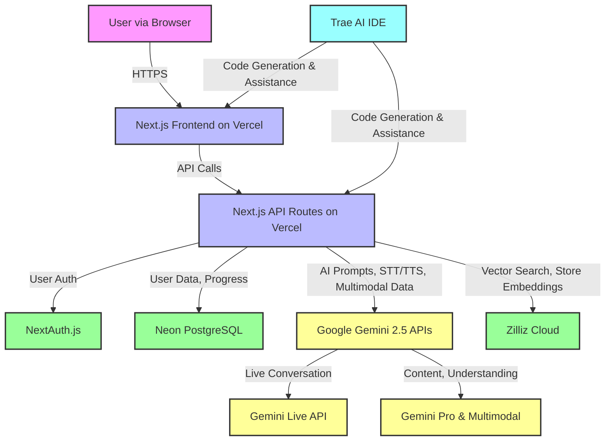

# High-Level Plan: AI-Powered Language Learning Platform

## 1. Executive Summary

**Project Name**: AI-Powered Language Learning Platform

**Elevator Pitch**: An innovative language learning platform that leverages Google Gemini 2.5's advanced multimodal AI and Zilliz Cloud's vector database capabilities to deliver a deeply personalized, adaptive, and interactive learning experience. Built with the Trae AI IDE, this platform aims to revolutionize language acquisition by offering real-time conversational practice, dynamic content generation, and intelligent assessment, all within a 30-hour hackathon timeframe.

**Core Problem**: Traditional language learning methods often lack personalization, engaging real-time practice, and adaptability to individual learner needs and paces.

**Solution**: A web application featuring:
*   **Adaptive Assessment Engine**: Continuously tailors learning paths using Zilliz Cloud for proficiency vector matching.
*   **Interactive AI Conversation Practice**: Real-time voice conversations with a Gemini-powered tutor providing immediate feedback.
*   **Personalized Multimodal Content**: Dynamically generated lessons (text, image, audio, video, URL context) by Gemini, relevant to user interests and skill level.

**Target Audience**: Self-directed adult learners (25-35) and university students (18-22) seeking flexible, effective, and engaging language instruction.

**Key Differentiators**:
*   Deep integration of Gemini 2.5's cutting-edge multimodal and live conversational AI.
*   Real-time adaptive learning powered by Zilliz Cloud vector similarity search.
*   Rapid development and iteration facilitated by the Trae AI IDE.
*   Focus on practical, conversational fluency through interactive scenarios.

## 2. Goals & Objectives

### 2.1 Business Goals (Hackathon Context)
*   Win the Trae AI & Google GenAI Hackathon by demonstrating exceptional application of technology, business value, originality, and presentation.
*   Showcase a viable and innovative product concept with potential for future development.

### 2.2 Product Goals
*   Deliver a functional MVP within the 30-hour hackathon constraint.
*   Provide a highly engaging and personalized language learning experience.
*   Effectively demonstrate the power of Gemini 2.5 and Zilliz Cloud in an educational context.

### 2.3 Key Success Metrics (KPIs)
*   **User Engagement (Demo)**: Average session duration > 15 mins; High interaction rate with AI tutor.
*   **Learning Effectiveness (Demo)**: Clear demonstration of personalized learning path and adaptive difficulty.
*   **Technical Performance**: AI response times < 2s; Stable demo environment.
*   **Hackathon Judging Criteria**: Score highly on Application of Technology, Business Value, Originality, and Presentation.

## 3. Target Audience & User Personas

### 3.1 Primary Target Audience
*   **Demographics**: Adults aged 25-35 (young professionals) and 18-22 (university students).
*   **Motivation**: Career advancement, travel, academic requirements, personal enrichment.
*   **Learning Style**: Prefer interactive, flexible, and technology-driven learning methods.

### 3.2 User Personas

*   **Alex (30, Marketing Professional)**:
    *   **Needs**: Learn Spanish for work/travel, flexible schedule, real conversation practice, personalized content.
    *   **Pain Points**: Limited time, finds generic courses unengaging, lacks speaking confidence.
*   **Maria (20, University Student - Linguistics)**:
    *   **Needs**: Supplement French studies, exam preparation, immediate feedback, engaging content.
    *   **Pain Points**: Classroom pace issues, needs more speaking practice, wants detailed progress tracking.

## 4. Scope & Features

### 4.1 MVP Feature List (Prioritized for 30-Hour Hackathon)

1.  **Adaptive Assessment Engine (Core - Zilliz & Gemini)**:
    *   **Description**: Initial and ongoing proficiency evaluation to personalize learning.
    *   **Rationale**: Foundation for personalized experience; showcases Zilliz vector search for matching proficiency.
2.  **Interactive Conversation Practice (Core - Gemini Live API)**:
    *   **Description**: Real-time voice conversations with an AI tutor, including feedback.
    *   **Rationale**: Addresses a key pain point (speaking practice); highlights Gemini Live API's capabilities.
3.  **Personalized Content Generation (Core - Gemini Multimodal & URL Context)**:
    *   **Description**: AI-generated reading, vocabulary, and grammar exercises tailored to user level and interests, including from URLs.
    *   **Rationale**: Demonstrates Gemini's content creation and multimodal understanding; provides varied learning material.
4.  **Progress Tracking Dashboard (Supporting)**:
    *   **Description**: Visual overview of learning progress and achievements.
    *   **Rationale**: Enhances user motivation and provides a sense of accomplishment.

### 4.2 Key User Stories/Flows for MVP

*   **New User Onboarding & Assessment**: User signs up -> Takes initial interactive assessment (voice/text with Gemini) -> Receives personalized learning path based on Zilliz-matched proficiency.
*   **Interactive Conversation Session**: User selects a conversation scenario -> Engages in voice chat with Gemini AI tutor -> Receives real-time feedback on pronunciation/grammar -> AI adapts responses based on user input.
*   **Personalized Learning Module**: User accesses a learning module -> AI (Gemini) generates a reading passage based on interest/level (potentially from a URL) -> User completes interactive exercises (vocabulary, comprehension) -> AI provides feedback and updates proficiency (Zilliz).
*   **Multimodal Exercise**: User is presented with an image/audio -> Gemini asks a question related to the media -> User responds -> Gemini evaluates the response.

### 4.3 Potential Post-MVP Features (Roadmap Ideas)

*   Advanced pronunciation analysis with phonetic feedback.
*   Smart review system (spaced repetition) using Zilliz for identifying weak areas.
*   Gamification (leaderboards, points, streaks).
*   Community features (peer interaction, study groups).
*   Instructor dashboard for classroom use.

## 5. High-Level System Architecture

### 5.1 Proposed Technology Stack

*   **Frontend**: Next.js 15.1.8 (App Router), React, DaisyUI, Tailwind CSS
    *   *Justification*: Rapid UI development, modern framework, rich component libraries, Vercel ecosystem synergy.
*   **Backend API**: Next.js API Routes, Vercel AI SDK
    *   *Justification*: Serverless functions for scalability, easy integration with frontend, Vercel AI SDK simplifies AI model interactions.
*   **AI Models**: Google Gemini 2.5 Pro (Core Reasoning, Content Generation), Gemini Live API (Conversational AI), Gemini Multimodal APIs (Image, Video, Audio, URL understanding), Gemini Speech-to-Text & Text-to-Speech.
    *   *Justification*: State-of-the-art multimodal and conversational capabilities, direct integration for hackathon sponsor requirements.
*   **Vector Database**: Zilliz Cloud (Managed Milvus)
    *   *Justification*: Efficient similarity search for adaptive assessment and personalized content retrieval, hackathon sponsor requirement.
*   **Relational Database**: Neon Database (Serverless PostgreSQL)
    *   *Justification*: Reliable storage for user data, progress, and structured content; serverless for ease of management.
*   **Authentication**: NextAuth.js
    *   *Justification*: Simple and secure authentication for Next.js applications.
*   **Deployment**: Vercel
    *   *Justification*: Seamless deployment for Next.js applications, CI/CD integration.
*   **Development Environment**: Trae AI IDE
    *   *Justification*: AI-assisted coding to accelerate development within the hackathon timeframe, sponsor requirement.

### 5.2 Architectural Diagram (Conceptual)

**Component Interactions:**
1.  **User Interaction**: User interacts with the Next.js frontend.
2.  **Frontend-Backend**: Frontend makes API calls to Next.js backend API routes for business logic and data.
3.  **AI Interaction**: Backend communicates with Google Gemini APIs for conversational AI, content generation, multimodal processing, STT/TTS.
4.  **Vector Search**: Backend uses Zilliz Cloud to store and query embeddings for adaptive assessment and personalized content matching.
5.  **Data Storage**: User profiles, progress, and structured data are stored in Neon PostgreSQL.
6.  **Authentication**: NextAuth.js handles user authentication.
7.  **Development**: Trae AI IDE assists in generating and managing code for both frontend and backend.

### 5.3 Key Technical Considerations

*   **Scalability**: Serverless architecture (Vercel, Neon, Zilliz Cloud) designed for scalability. Focus on efficient API design.
*   **Performance**: Optimize Gemini API calls (prompt engineering, minimizing payload). Efficient vector indexing and search in Zilliz. Frontend rendering optimization (Next.js).
*   **Security**: Secure API key management (environment variables). Basic input validation. HTTPS. Authentication via NextAuth.js.
*   **Reliability**: Leverage managed services (Vercel, Zilliz, Neon, Google Cloud) for high availability. Implement graceful error handling for API calls.
*   **API Latency**: Critical for conversational AI. Utilize Gemini Live API for low-latency streaming. Optimize prompts for faster Gemini responses.

### 5.4 Data Management Strategy

*   **User Data (Neon DB)**: Profiles, authentication details, learning preferences, progress metrics, achievements.
*   **Content Embeddings (Zilliz Cloud)**: Vector embeddings of learning materials, user responses, proficiency benchmarks for similarity search.
*   **Generated Content Cache (Neon DB - optional)**: Potentially cache frequently accessed AI-generated content to reduce API calls, though primary generation will be dynamic.
*   **Data Flow for Assessment**: User input -> Gemini for understanding -> Embedding generated -> Zilliz for similarity search against proficiency benchmarks -> Adapted learning path.

### 5.5 API Strategy

*   **Internal APIs**: RESTful APIs exposed via Next.js API routes for frontend-backend communication.
*   **External APIs**:
    *   Google Gemini APIs (Vertex AI SDK / REST).
    *   Zilliz Cloud API (Python SDK / REST).
*   **Versioning**: Not critical for hackathon MVP, but would be `v1` if formalized.

## 6. Monetization Strategy (Post-Hackathon Idea)

*   **Freemium Model**: Basic features and limited usage free.
*   **Subscription Tiers**:
    *   **Basic**: Access to more lessons, limited AI tutor time.
    *   **Premium**: Unlimited access, advanced features, priority support.
*   **Institutional Licenses**: For schools or businesses.

## 7. Competitive Landscape & Differentiation

*   **Existing Solutions**: Duolingo, Babbel, Rosetta Stone, ELSA Speak.
*   **Differentiation**:
    *   **Advanced AI Integration**: Deeper, more nuanced personalization and interaction with Gemini 2.5 (multimodal, live conversation, URL context) compared to existing apps that may use older or less capable AI.
    *   **Real-time Adaptability**: Zilliz Cloud-powered vector search enables truly dynamic difficulty adjustment and content personalization beyond rule-based systems.
    *   **Focus on Conversational Fluency**: Gemini Live API provides a more natural and responsive conversational partner.
    *   **Innovative Content Sources**: Ability to use URL context for generating relevant, real-world learning materials.

## 8. Key Risks & Mitigation Strategies

| Risk Category          | Risk Description                                                                 | Likelihood | Impact | Mitigation Strategy                                                                                                                               |
| :--------------------- | :------------------------------------------------------------------------------- | :--------- | :----- | :------------------------------------------------------------------------------------------------------------------------------------------------ |
| **Technical**          | Gemini API Latency/Quota Issues                                                  | Medium     | High   | Optimize prompts; implement client-side loading indicators; have fallback static content if APIs are slow/unavailable during demo. Request quota increase if possible. |
|                        | Zilliz Cloud Integration Complexity                                              | Medium     | Medium | Start with simple vector operations; use Python SDK for easier integration; pre-prepare sample data and schema.                                       |
|                        | Browser compatibility for Web Speech/WebRTC (Gemini Live)                        | Low        | Medium | Test on target demo browser (latest Chrome); have alternative input methods (text) as a minimal fallback.                                         |
| **Development**        | Scope Creep / Time Constraint (30 hours)                                         | High       | High   | Strictly adhere to MVP; prioritize core features; leverage Trae AI for rapid code generation; use pre-built UI components (DaisyUI).                     |
|                        | Team Member Skill Gap for Specific Tech                                          | Low        | Medium | Pair programming; focus on areas of strength; leverage Trae AI's assistance and documentation search.                                               |
| **Hackathon Specific** | Demo Failure (Connectivity, API Outage)                                          | Medium     | High   | Pre-record parts of the demo; have local fallback data/mocked API responses if live systems fail; test demo setup thoroughly.                        |
|                        | Misalignment with Judging Criteria                                               | Low        | High   | Continuously refer to hackathon guidelines; clearly articulate how each feature meets criteria in the presentation.                                 |

## 9. Assumptions & Open Questions

### 9.1 Assumptions
*   Stable and performant access to Google Gemini APIs and Zilliz Cloud throughout the hackathon.
*   Trae AI IDE will significantly accelerate development of boilerplate and core logic.
*   The chosen tech stack components will integrate smoothly.
*   Basic UI/UX with DaisyUI will be sufficient for a compelling demo.
*   Team has the necessary skills to implement the core MVP features.

### 9.2 Open Questions (to be addressed during development)
*   Optimal prompt engineering strategies for Gemini to balance creativity, accuracy, and conciseness for learning content?
*   Most effective vector indexing strategy in Zilliz for proficiency matching within the hackathon's data scale?
*   Specific UI flow for the adaptive assessment to make it engaging and not feel like a test?
*   How to best showcase the multimodal capabilities (image/audio/video understanding) within a short demo?

## 10. Next Steps (Immediate Actions for Hackathon)

1.  **Phase 1: Foundation Setup (Hours 1-6)**
    *   Setup project repository, Next.js boilerplate, Vercel deployment.
    *   Integrate Neon DB, Zilliz Cloud, and configure Gemini API access (API keys, SDKs).
    *   Basic UI layout with DaisyUI, navigation, authentication (NextAuth.js).
    *   Define initial data schemas for User, Progress (Neon) and basic vector schema (Zilliz).
2.  **Phase 2: Core Features Development (Hours 7-20)**
    *   Implement Adaptive Assessment Engine (Gemini for interaction, Zilliz for matching).
    *   Develop Interactive Conversation Practice (Gemini Live API, STT/TTS).
    *   Build Personalized Content Generation (Gemini for text/multimodal/URL context, Zilliz for retrieval).
3.  **Phase 3: Advanced Features & Polish (Hours 21-26)**
    *   Implement Progress Tracking Dashboard.
    *   Integrate basic multimodal exercises (image/audio understanding with Gemini).
    *   Refine UI/UX, add instructional text, improve visual appeal.
4.  **Phase 4: Testing & Deployment (Hours 27-30)**
    *   End-to-end testing of all MVP features.
    *   Prepare demo script and practice presentation.
    *   Final deployment checks on Vercel.
    *   Buffer time for bug fixing and final polish.

This High-Level Plan provides the strategic roadmap for developing the AI-Powered Language Learning Platform within the Trae AI & Google GenAI Hackathon. It will be used in conjunction with the PRD to guide development efforts.